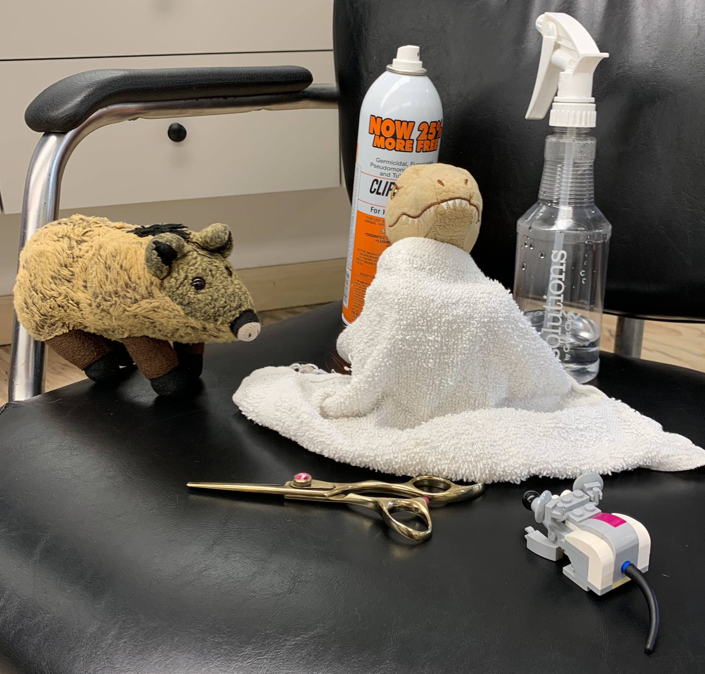
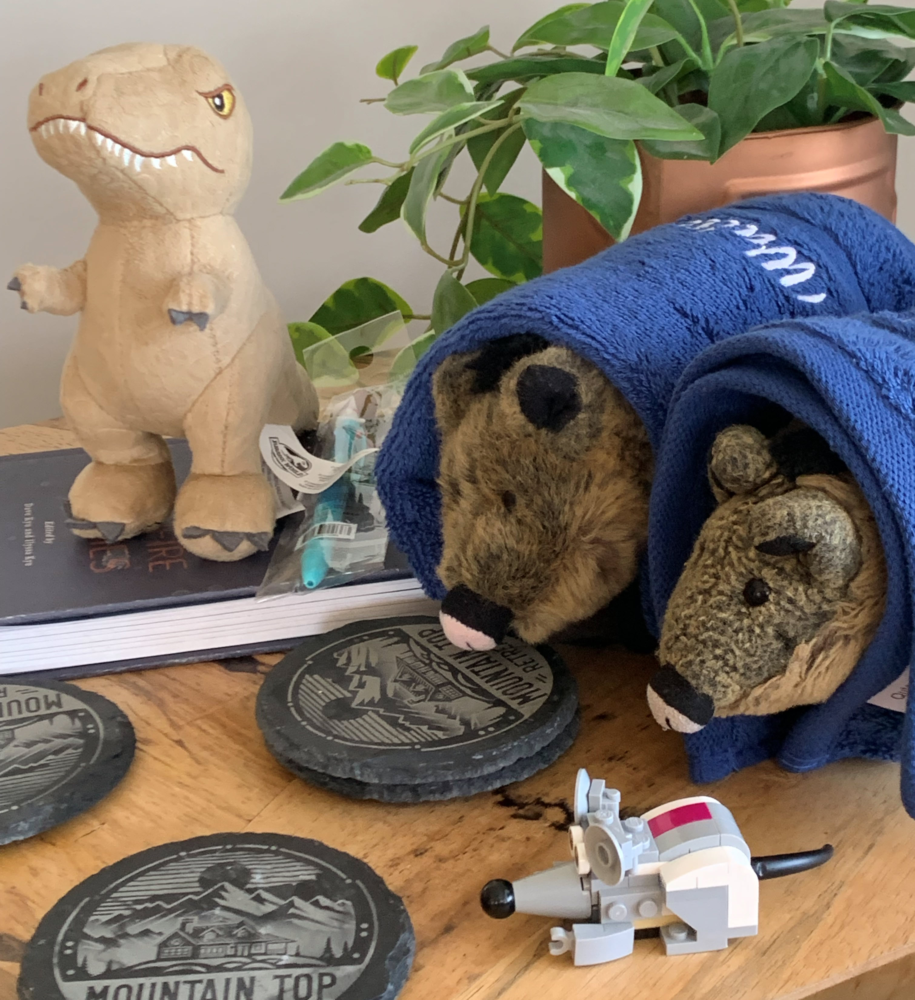
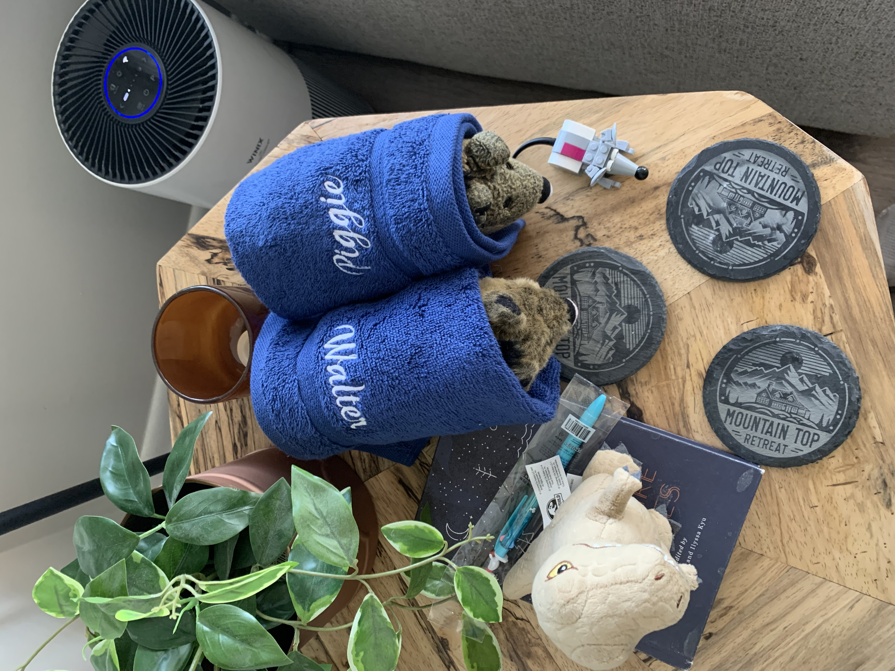
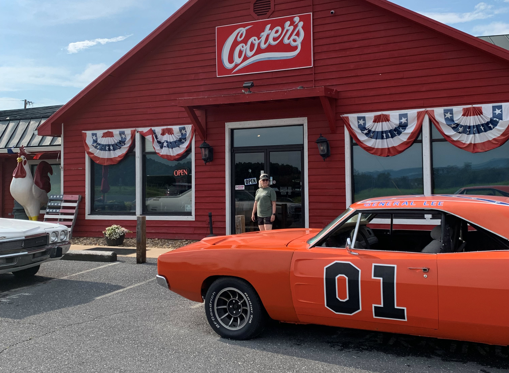
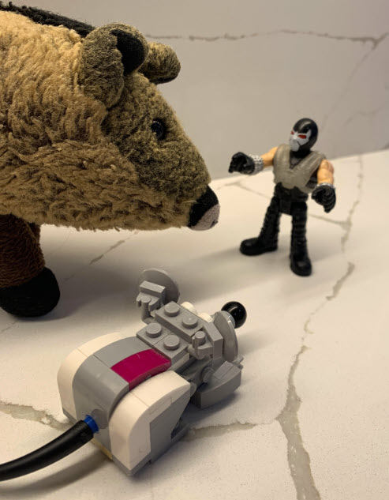
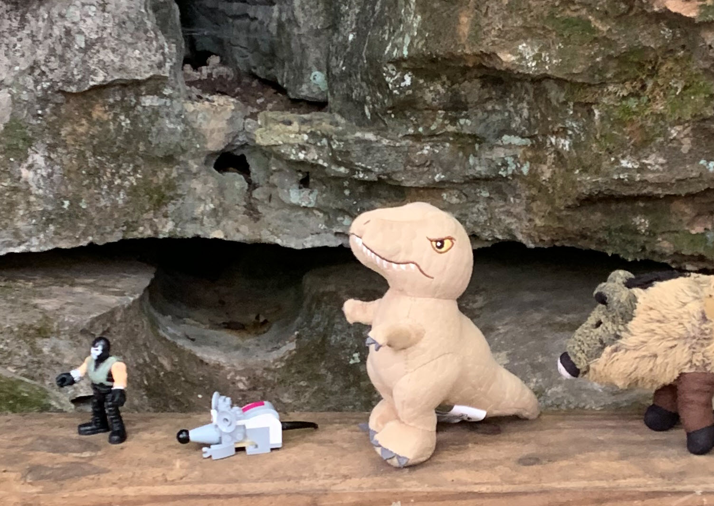
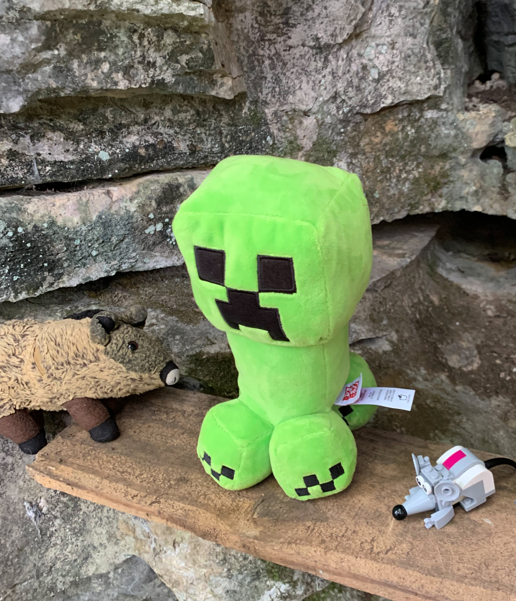
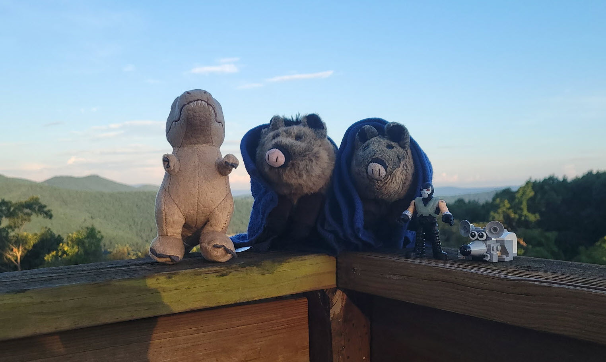

# Shenandoah
> July 28, 2025
> by Piggie

We spent a long weekend in Shenandoah Valley, Virginia.

Our drive to Shenandoah took us close to Mount Airy, North Carolina. We couldn't pass up the hometown of actor Andy Griffith. We visited his museum and ate at Snappy Lunch Cafe on downtown Main Street. Snappy is home of the world-famous pork chop sandwich. Yeah, I stayed out of the kitchen!

Floyd's Barber Shop is right next door to Snappy, but it was closed for the day. Mr. T was disappointed; he had been waiting for Floyd to give him his very first haircut. We drove to a Great Clips salon instead.

Mr. T snuggled into his barber cape while Nibbles and I discussed why Mr. T had hair in the first place.

When we arrived at the Airbnb, Walter and Susan were waiting for us! Walter and I wrestled on the sofa and laughed till we hurt. He's bigger than me, but I know his ticklish spots.

Mom bought us matching monogrammed blankets! We spent the evening wrapped in our blankies. We doodled, colored, and worked on a jigsaw puzzle late into the night.

We visited Cooter's Museum and Store – a tourist trap of memorabilia and overpriced souvenirs from the old TV show The Dukes of Hazzard. Mom stopped at the door to check on us. But while the adults went inside, we boys climbed into the orange General Lee for an adventure.

I busted out my best Uncle Jessie voice: "Them Duke Boys are in a heap of trouble now. They are running a keg of bootleg root beer, but Sheriff Rosco P. Coltrane is hot on their tail." I stressed the "P" middle initial very dramatically.

Mr. T worked the gas and brake pedals since he has the biggest feet. Walter took the gear shift, and I sat in the driver's seat and steered. Nibbles called driving commands down to us from the dashboard.

A sign on the General Lee warned us not to slide across the hood like Luke Duke did in every episode. But we slid anyway. Nibbles got stuck halfway and had to scoot down off the front of the car. When a group of tourists heard the commotion, he froze and pretended to be a hood ornament. Quick thinking, Nibbles!

On one of our vacation days, we took a leisurely float trip on inner tubes down the Shenandoah River. Halfway down the river, we found a rope swing that bested everyone in our acrobatic family. (That was sarcasm.) While nursing our pride over lunch beneath the swing, we found this little guy sitting on a log beside the water.

He introduced himself as Bane, a supervillain action figure from the D.C. universe. He was just so tiny and cute! We nicknamed him "Cuddles", and he joined our adventures.

He saved our lives when we toured the dark and beautiful Luray Caverns. The adults stayed on the marked path, but we kids explored the tunnels less traveled (and less lit.) We were hopelessly lost in the pitch black when we discovered that Cuddles' chest armor glows in the dark! He was our Rudolph the reindeer with a glowing green chest instead of a red nose. He led us safely back to the family.

Nibbles was fussy and nervous the whole time we were in the cave. He spends a lot of time playing Minecraft, and he warned us about something called "hostile mobs" that live in caves.

That's when an ominous green Creeper sneaked up behind us. Nibbles dove behind a rock, but I had never met a Creeper. I struck up a conversation.

It turns out he wasn't a real Creeper. His name was Bob. He was a plush from the gift shop. He likes to spend his lunch breaks down in the caves scaring the kids. He peeked around the rock where Nibbles was hiding and yelled "BOOOOM!".

We treated Nibbles to ice cream in the gift shop to calm his nerves.

Here we are on the last evening on the porch of the Airbnb overlooking the Shenandoah Valley. It was a short vacation, but we packed in a lot of adventure.

