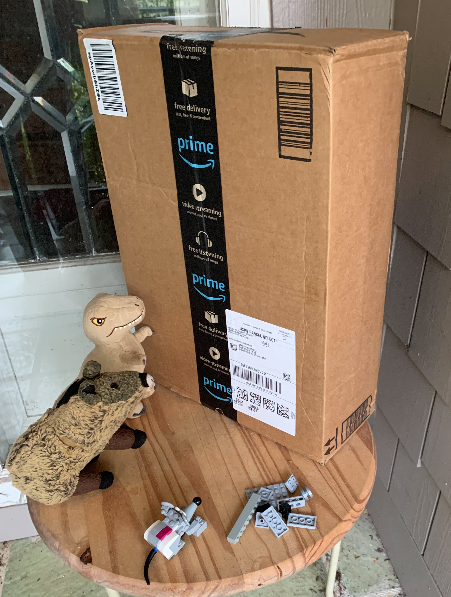

# The Monolith
> September 5, 2025
> by Piggie

In the pre-dawn hours of Friday, a mysterious monolith appeared on the front porch.

An arid wind blew over the boys as they stared into it, unmoving. An eerie choir of moaning voices pierced the morning silence. The first few notes of “Also sprach Zarathustra” boomed over the voices. An idea began to take shape in Nibbles' mind – woven into it by the monolith. He reached for the large femur-shaped brick from the pile of Lego bones. Yes, that playful cat from next door would no longer be a problem.

